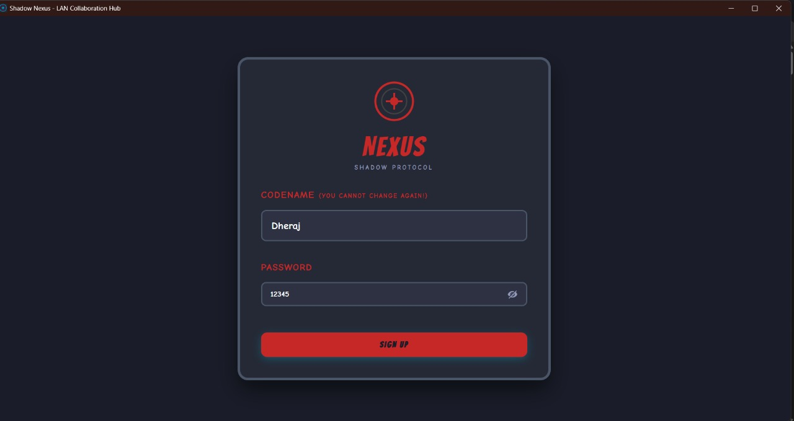
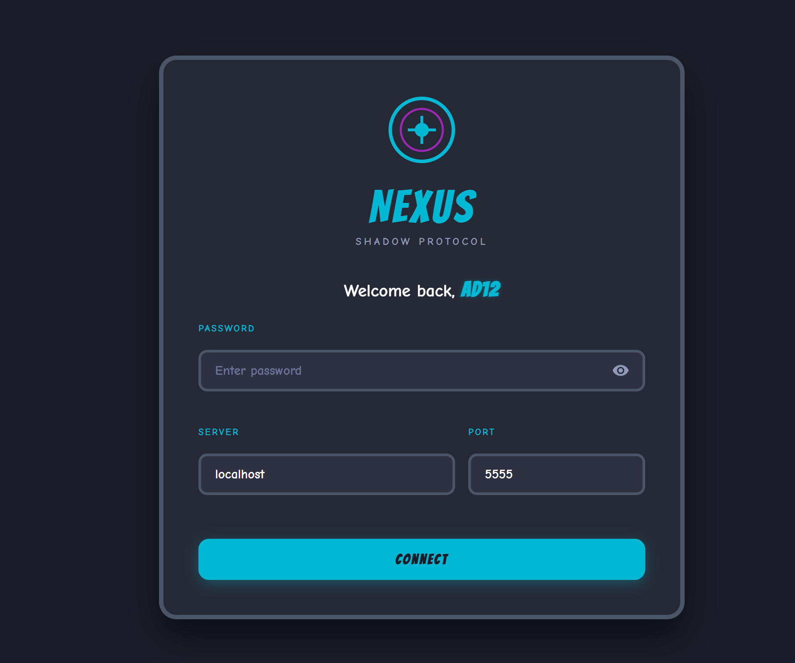
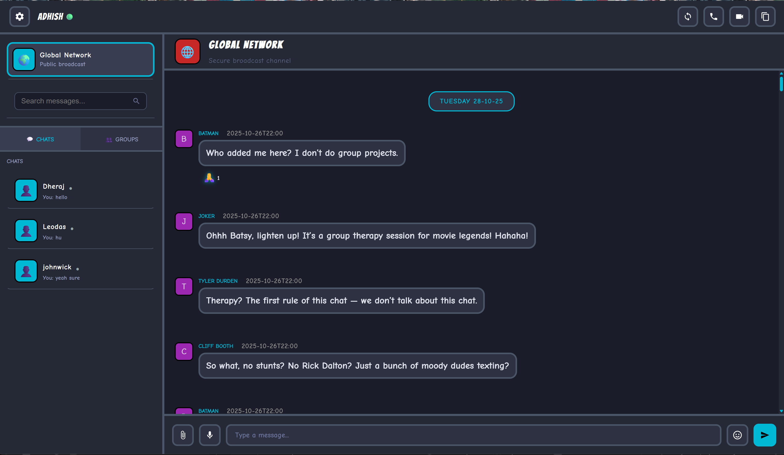
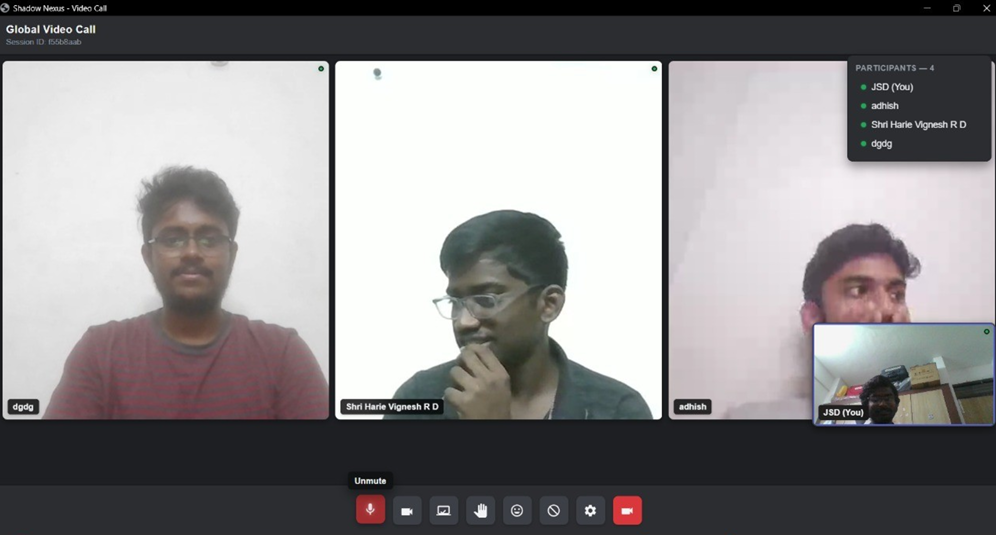
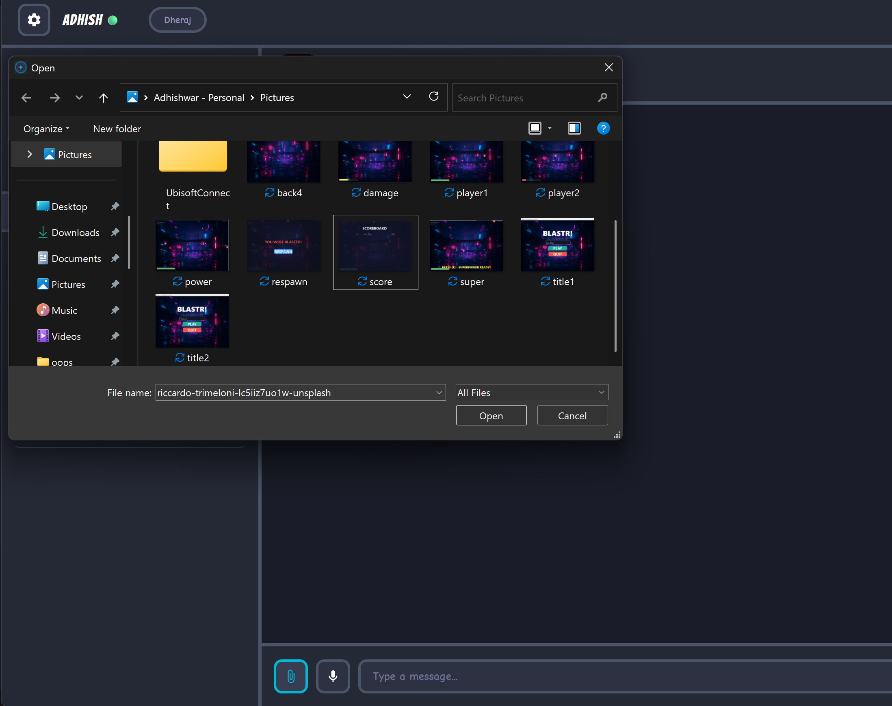
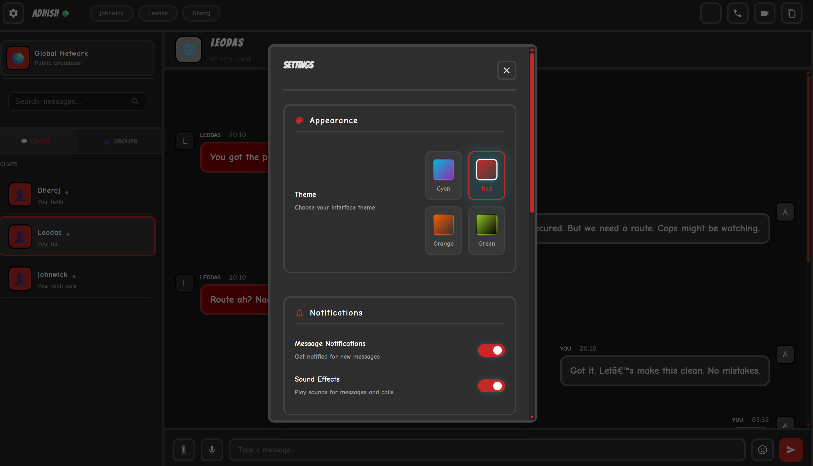

# Shadow Nexus 🌐

**A modern LAN-based chat and collaboration platform with real-time messaging, video calls, and file sharing.**

> 🏠 **LAN-First Design** - Optimized for local networks, hotspots, and offline environments


## 📸 Screenshots & Features
<div style="display: flex; flex-wrap: wrap; justify-content: center; gap: 40px;">

  <div style="flex: 0 0 45%; text-align: center;">
    
    <div>Signup</div>
  </div>

  <div style="flex: 0 0 45%; text-align: center;">
    
    <div>login</div>
  </div>

  <div style="flex: 0 0 45%; text-align: center;">
    
    <div>Broadcast Channel</div>
  </div>
  <div style="flex: 0 0 45%; text-align: center;">
    
    <div>video call</div>
  </div>


  <div style="flex: 0 0 45%; text-align: center;">
    
    <div>File Transfer</div>
  </div>


  <div style="flex: 0 0 45%; text-align: center;">
    
    <div>settings</div>
  </div>

  

  
</div>


## ✨ Key Features

### 💬 **LAN Communication**
- ✅ Global Chat - Everyone on your local network
- ✅ Private Chat - 1-on-1 conversations
- ✅ Group Chat - Create custom groups
- ✅ Audio Messages - Voice recordings stored locally
- ✅ Message Replies - Quote and reply to specific messages

### 🎥 **LAN Video Calls**
- ✅ WebRTC Video - High-quality peer-to-peer over LAN
- ✅ Screen Sharing - Share your screen with participants
- ✅ Up to 10 Participants - Group video calls
- ✅ Colorful Thumbnails - 12 unique themes when camera is off
- ✅ Reactions & Hand Raise - Non-verbal communication

### 📁 **Local File Sharing**
- ✅ Large Files - Up to 2GB per file over LAN
- ✅ Any File Type - Documents, images, videos, archives
- ✅ Local Storage - Files saved securely on server

### 🔐 **LAN Security**
- ✅ Device-Based Auth - One account per device (MAC address)
- ✅ Local Password Storage - Encrypted passwords stored locally
- ✅ Security Questions - Password recovery without internet

### 🎨 **User Experience**
- ✅ Multiple Theme - Modern/dark mode with smooth animations
- ✅ Instant Loading - ~1 second startup time
- ✅ Auto Port Detection - No conflicts on LAN
- ✅ Offline Capable - Works without internet connection
- ✅ Responsive UI - Works on desktop and tablets

---

## 🚀 Quick Start (Running from Terminal)

### 📋 Prerequisites
- **Python 3.12+** installed ([Download Python](https://www.python.org/))
- **Windows, Linux, or Mac**

### 🔧 Installation & Setup

#### Step 1: Clone / Extract Repository
```bash
git clone <repository-url>
cd shadow-nexus
```

#### Step 2: Install Dependencies
```bash
pip install -r requirements.txt
```

#### Step 3: Run the Servers

**Option A: All-in-One Unified Server (RECOMMENDED)**
```bash
python unified_server.py
```
This automatically detects your IP, starts all servers, and updates `.env`

**Option B: Manual - Run Each Server Separately**
```bash
# Terminal 1: Start Chat Server
python -m backend.server

# Terminal 2: Start Video Server (in another terminal)
python -m backend.video_module

# Terminal 3: Start Client (in another terminal)
python client.py
```

#### Step 4: Access the Application
- The browser will automatically open
- If not, go to: `http://localhost:8081`
- **First time?** Create account → Login → Done!

---

### � Building an Executable (.EXE)

Create a standalone executable for distribution (no Python needed!):

#### Step 1: Verify Build Requirements
```bash
python verify_build_requirements.py
```
Expected output: `✅ All checks passed! Ready to build.`

#### Step 2: Build the Unified Server Executable
```bash
build_scripts\build_unified.bat
```
Or on Linux/Mac:
```bash
python -m PyInstaller build_scripts/ShadowNexusServer.spec
```

#### Step 3: Locate Your Executable
```
dist/ShadowNexusServer/ShadowNexusServer.exe
```

#### Step 4: Run the Executable
Simply **double-click** the `.exe` file or run:
```bash
dist\ShadowNexusServer\ShadowNexusServer.exe
```

**Output:**
```
✅ All Servers Started!
🌐 Server IP Address: 192.168.1.100
📡 Chat Server: 192.168.1.100:5555
📁 File Server: 192.168.1.100:5556
🔊 Audio Server: 192.168.1.100:5557
📹 Video Server: 192.168.1.100:5000
✅ Clients can connect to: 192.168.1.100
```

#### Step 5: Share with Others
1. Copy the entire `dist/ShadowNexusServer/` folder
2. Share via USB, email, or network
3. Users extract and run the `.exe`
4. **No Python installation needed!**

---

### 📂 Project Structure - Core Architecture

> **💡 The core client-server logic is in the `backend/` folder**

```
shadow-nexus/
├── 🎯 ROOT LEVEL (Executables & Launchers)
│   ├── unified_server.py          ⭐ Run this for all-in-one server
│   ├── server_launcher.py         ⭐ Environment + process manager
│   ├── client.py                  ⭐ Desktop client (Eel GUI)
│   └── ShadowNexusServer.spec     ⭐ PyInstaller build config
│
├── 📦 backend/ (CORE SERVER-CLIENT LOGIC)
│   ├── __init__.py
│   ├── server.py                  🔥 Main chat server (5555, 5556, 5557)
│   ├── video_module.py            🎥 Video call server (WebRTC, port 5000)
│   ├── audio_module.py            🔊 Audio streaming
│   ├── storage.py                 💾 JSON-based persistence
│   ├── auth_module.py             🔐 Device-based authentication
│   └── cert_manager.py            🛡️ SSL certificate management
│
├── 🎨 Frontend (GUI & Web Interface)
│   ├── web/
│   │   ├── index.html             📄 Main UI structure
│   │   ├── app.js                 ⚡ JavaScript logic
│   │   └── style.css              🎨 Styling & themes
│   ├── templates/
│   │   ├── video_room.html        📹 Video call UI
│   │   └── audio_room.html        🔊 Audio call UI
│   └── static/                    📁 Images, icons, assets
│
├── 🔨 Build & Run Scripts
│   ├── build_scripts/             📦 Build executables
│   │   ├── build_unified.bat
│   │   ├── build_exe.bat
│   │   └── build_server.bat
│   ├── run_scripts/               ▶️ Run applications
│   │   ├── start_unified.bat
│   │   ├── start_server.bat
│   │   └── start_all_servers.ps1
│   ├── cert_scripts/              🔐 Certificate management
│   │   ├── fix_ssl_certificate.ps1
│   │   └── regenerate_certs.ps1
│   └── tools/                     🛠️ Utilities
│
├── 💾 Data Storage
│   └── shadow_nexus_data/         📊 All data saved here
│       ├── users_auth.json
│       ├── users.json
│       ├── global_chat.json
│       ├── private_chats.json
│       ├── group_chats.json
│       └── files.json
│
└── 📚 Documentation
    ├── docs/
    │   ├── README.md              👈 You are here
    │   └── MKCERT_SETUP.md        🔐 SSL certificate guide
    ├── requirements.txt           📋 Python dependencies
    └── QUICKSTART.txt             🚀 Quick reference
```

### 🎯 Where to Make Changes

| What to Change | Where | Language |
|---|---|---|
| Chat logic, server behavior | `backend/server.py` | Python |
| Video/WebRTC features | `backend/video_module.py` | Python |
| Authentication system | `backend/auth_module.py` | Python |
| Data storage | `backend/storage.py` | Python |
| UI design | `web/index.html` | HTML |
| Frontend interactivity | `web/app.js` | JavaScript |
| Styling & themes | `web/style.css` | CSS |

---

## 🔧 Configuration

### Ports Used

| Port | Service | Purpose | Backend File |
|------|---------|---------|---|
| 5555 | Chat Server | Text messages | `backend/server.py` |
| 5556 | File Server | File transfers | `backend/server.py` |
| 5557 | Audio Server | Audio streaming | `backend/server.py` + `backend/audio_module.py` |
| 5000 | Video Server | WebRTC signaling | `backend/video_module.py` |
| 8081+ | Client UI | Web interface (Eel) | `client.py` + `web/` |

### Environment Variables (.env)
```env
SERVER_IP=192.168.1.100
CHAT_PORT=5555
FILE_PORT=5556
VIDEO_PORT=5000
AUDIO_PORT=5001
```

---

## 💡 How It Works - The Backend Architecture

### 🎯 Core Backend (`backend/` folder)

All the real-time communication logic lives in the `backend/` folder:

```
BACKEND (Python)
├── server.py
│   ├── CollaborationServer (Main orchestrator)
│   ├── Handles all socket connections
│   ├── Routes messages to clients
│   ├── Manages chat data
│   ├── Handles file uploads/downloads
│   └── Stores everything in JSON
│
├── video_module.py
│   ├── WebRTC signaling server
│   ├── Manages video peer connections
│   ├── Flask + Socket.IO
│   └── Port: 5000
│
├── audio_module.py
│   ├── Real-time audio streaming
│   ├── Audio capture & playback
│   └── PyAudio integration
│
├── storage.py
│   ├── JSON-based data persistence
│   ├── Chat history storage
│   ├── User data management
│   └── File metadata storage
│
├── auth_module.py
│   ├── Device-based authentication
│   ├── MAC address identification
│   ├── Password hashing & verification
│   └── Security questions
│
└── cert_manager.py
    ├── SSL certificate generation
    ├── HTTPS support
    └── mkcert integration
```

### 📡 Communication Flow

```
User Types Message (Browser)
         ↓
[JavaScript] - web/app.js
         ↓
[Eel Bridge] - Python-JS communication
         ↓
[Python Client] - client.py
         ↓
[TCP Socket] - TCP/IP connection
         ↓
[Backend Server] - backend/server.py (Port 5555)
         ↓
[Storage] - backend/storage.py (JSON files)
         ↓
[Broadcast] - Send to all connected clients
         ↓
[Update Display] - Real-time update for everyone
```

### 🔐 Authentication Flow (Backend)

```
Signup
  ↓
[backend/auth_module.py] → Hash password + Store in JSON
[backend/storage.py] → Save user data
  ↓
Login
  ↓
[backend/auth_module.py] → Verify password
[backend/server.py] → Create socket session
  ↓
Connected & Authenticated
```

### 📁 File Transfer Flow (Backend)

```
Upload File (Frontend)
  ↓
[web/app.js] → Send via Eel
  ↓
[client.py] → Receive from browser
  ↓
[backend/server.py] → Socket upload handler
  ↓
[backend/storage.py] → Save to disk + Store metadata
  ↓
[Broadcast to All] → Notify other clients
  ↓
Download Link Created
```

### 🎥 Video Call Flow (Backend)

```
Initiate Call
  ↓
[backend/video_module.py] → Create peer connection
[Port 5000 - WebRTC Signaling]
  ↓
Exchange ICE Candidates & Offer/Answer
  ↓
Direct P2P Connection (over LAN)
  ↓
Video Stream (Encrypted, No Server Intermediary)
```

---

## 💻 Modifying the Backend

The `backend/` folder is where all the magic happens. Here's what you can modify:

### Chat Server Modifications
**File:** `backend/server.py`

```python
# Add a new command handler
@server.on_connect
def handle_new_message(data):
    # Your custom logic here
    broadcast_to_all(data)
```

### Video Server Customizations
**File:** `backend/video_module.py`

```python
# Customize WebRTC behavior
# Add recording, filters, effects, etc.
```

### Storage Customizations
**File:** `backend/storage.py`

```python
# Switch from JSON to database if needed
# Add encryption layer
# Implement backup system
```

### Authentication Customizations
**File:** `backend/auth_module.py`

```python
# Add 2FA
# Implement role-based access
# Add more security layers
```

---

## 🐛 Troubleshooting

### Port Already in Use
- Client auto-detects next available port (8082, 8083...)
- Server: Stop existing instance or change port

### Connection Refused
- Verify server is running
- Check IP address is correct
- Ensure firewall allows connections

### SSL Certificate Warnings (FIXED!)
- **NEW**: Use mkcert for trusted certificates (no warnings!)
- Run: `.\setup_mkcert.ps1` (see [QUICK_START_SSL.md](QUICK_START_SSL.md))
- Works offline, professional experience
- Old method: Click "Advanced" → "Proceed anyway"

### Audio Not Working
- Check microphone permissions
- Verify PyAudio is installed
- Test with: `python -m pyaudio`

---

## 📚 Documentation

For detailed information, see:
- **[QUICK_START_SSL.md](QUICK_START_SSL.md)** - 🔒 Fix browser SSL warnings (3 steps!)
- **[MKCERT_SETUP.md](MKCERT_SETUP.md)** - Complete SSL certificate guide
- **[DOCUMENTATION.md](DOCUMENTATION.md)** - Complete technical guide
- **[QUICK_START.md](QUICK_START.md)** - Step-by-step tutorial
- **[README_EXE.md](README_EXE.md)** - Executable build guide

---

## 🛠️ Development

### Adding Features
1. Backend: Add handler in `server.py`
2. Frontend: Update `web/app.js` and `web/index.html`
3. Bridge: Use `@eel.expose` for Python functions

### Testing
```bash
# Run multiple clients
python client.py 8081
python client.py 8082
python client.py 8083
```

### Debugging
- Client logs: Terminal running `client.py`
- Server logs: Terminal running `server.py`
- Browser console: Press F12

---

## 📊 Tech Stack

**Backend:**
- Python 3.12
- Socket programming (TCP)
- Flask + Socket.IO (WebRTC)
- PyAudio (Audio)

**Frontend:**
- HTML5 + CSS3
- Vanilla JavaScript
- Eel (Python-JS bridge)
- WebRTC (Video)

**Storage:**
- JSON files (lightweight, portable)

---

## 🎓 Requirements

```
eel>=3.1.4
pyaudio>=0.2.13
numpy>=1.24.0
opencv-python>=4.8.0
requests>=2.31.0
flask>=3.0.0
flask-socketio>=5.3.0
cryptography>=41.0.0
```

Install all:
```bash
pip install -r requirements.txt
```

---

## 🤝 Contributing

This is a personal/educational project. Feel free to:
- Fork and modify
- Report issues
- Suggest improvements

---

## 📝 License

MIT License - Free for personal and educational use.

---

## 🌟 Highlights

- ⚡ **Fast** - 1 second startup, instant LAN messaging
- 🎨 **Modern** - Sleek dark theme with smooth animations
- 🔒 **Secure** - Device-based auth, local encryption
- 💾 **Persistent** - All data saved locally on server
- 🌐 **LAN-First** - Works completely offline, no internet needed
- 📦 **Portable** - Single executable, perfect for offline environments

---

## 📞 Support

**Having issues?**
1
2. Review error messages in terminal
3. Check browser console (F12)
4. Verify all servers are running

---

**Built with ❤️ and ☕**

*Shadow Nexus - Where LAN collaboration happens in real-time, no internet required*
